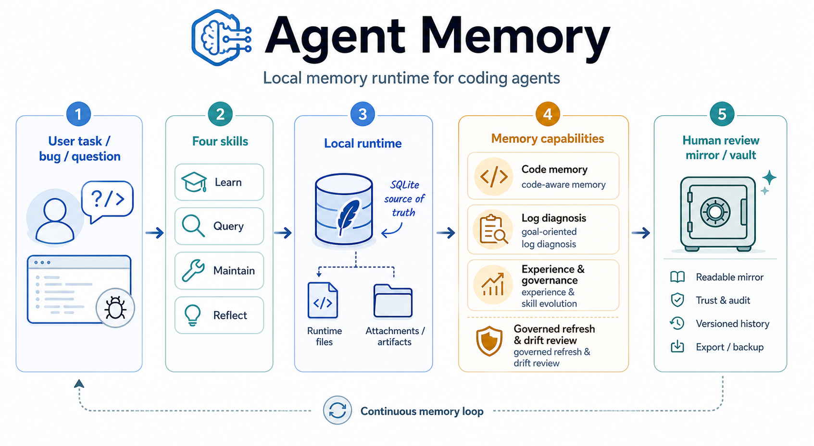

# Agent Memory MVP

[中文说明](README.zh-CN.md)

Agent Memory is a local memory, reflection, governance, and investigation-context runtime for coding agents.

It gives a local Agent CLI a stable way to retrieve project facts, code context, runtime incident evidence, and reusable lessons without requiring a vector database, daemon, graph database, or agent-specific wrapper. The Agent performs diagnosis and design reasoning; the Runtime only supplies bounded, inspectable context.



## Why Agents Need Memory

Current coding agents are strong inside one session, but weak across sessions and repeated tasks.

Common problems:

- they re-read the same files and rediscover the same routes, symbols, and logs
- they forget why a previous diagnosis worked
- they do not retain project-specific business semantics well
- they can inspect raw logs, but often lack a stable bridge from user symptoms to code logs to bounded runtime evidence
- chat history grows, but becomes noisy, fragile, and hard to govern

A practical memory system should do more than store text. It should help the agent:

- learn project scope incrementally
- retrieve concise context before work
- reflect after work
- govern stale or weak memory
- connect code logs and runtime evidence back into reusable experience

That is the role of Agent Memory.

## What This Project Solves

Agent Memory is designed to solve these practical problems:

1. **Project context loss**
   - repeated rediscovery of the same files, symbols, routes, resources, and logs

2. **Weak reusable diagnosis memory**
   - a successful bug investigation often disappears after the session ends

3. **Code understanding without heavy infrastructure**
   - teams want inspectable local memory without introducing services or heavyweight retrieval systems

4. **Runtime-log diagnosis drift**
   - raw logs alone are noisy; agents need help moving from user symptoms to code log anchors to bounded runtime evidence

5. **Memory quality decay**
   - as projects change, old structure, old semantics, and old experience can become stale

## Design Principles

Agent Memory stays intentionally conservative:

- SQLite is the source of truth
- Obsidian vault is a generated human-readable mirror
- `tools/agent_memory.py` is the only runtime entry point
- the user-facing interface stays fixed at **four skills**
- raw runtime logs are temporary evidence, not long-term memory
- current source files always override historical memory
- governance is read-first and confirmation-oriented

This is a memory runtime, not a full autonomous knowledge graph.

## Project Feature Overview

```text
User task / symptom
  -> agent chooses one of four skills
  -> skill calls tools/agent_memory.py
  -> runtime reads/writes SQLite memory
  -> runtime emits bounded context, review actions, or reflection payloads
  -> Obsidian vault mirrors the current state for human review
```

The project is especially optimized for:

- **code-aware memory**
- **goal-oriented log context for Agent-led diagnosis**
- **experience and skill evolution**
- **governed refresh and drift review**

## Memory System Design

The memory layer is split by responsibility.

### 1. Semantic Facts

Durable project knowledge that should survive beyond one task.

Representative fields:

- `fact`
- `source`
- `confidence`
- `scope`
- `evidence`
- `status`
- `use_count`
- `last_used_at`

### 2. Episodes

Task- or incident-level summaries.

Representative fields:

- `task`
- `summary`
- `outcome`
- `files_touched`
- `commands_run`
- `importance`

### 3. Reflections

Structured lessons after diagnosis, design, execution, or workflow attempts.

Representative fields:

- `task_type`
- `experience_type`
- `problem`
- `reasoning_summary`
- `what_worked`
- `what_failed`
- `verification_method`
- `repair_action`
- `useful_followup_focus`
- `useful_followup_terms`
- `misleading_followup_terms`
- `inspection_targets`
- `final_verification_path`

### 4. Codebase Wiki

A lightweight learned model of the codebase.

It stores:

- files
- symbols
- code log statements
- deterministic memory edges

This supports incremental code learning without requiring a full call graph or external search service.

### 5. Code Log Memory

One of the project-specific strengths of this system is that logs are first-class memory anchors.

During learning, the runtime extracts code log statements and links them back to:

- file
- function or symbol
- route
- resource
- nearby business semantics

This lets the agent move from:

```text
user symptom
-> relevant code log anchors
-> runtime log search plan
-> bounded runtime evidence
```

instead of treating logs as raw text blobs.

### 6. Runtime Usage Sample

The system also keeps a lightweight runtime-only usage summary:

- recent commands used
- query rounds
- followup focus
- suggested terms
- dominant runtime signals
- candidate chain
- governance lanes touched

This is stored as a runtime file, not as a new long-term database table.

Its purpose is to reduce reflection overhead by letting `reflect` auto-fill missing structured fields from the most recent bounded work trail.

## Experience System Design

The experience layer is intentionally split into two kinds.

### Procedure Experience

Reusable workflows.

This is the branch that can evolve into:

```text
reflection
-> procedure_experience
-> skill pattern
-> skill draft
-> skill candidate package
-> formal skill
```

### Correction Experience

Memory correction and semantic repair.

This branch feeds:

```text
correction_experience
-> learn governance
-> semantic repair
-> better future memory quality
```

### Incident Strategy And Recurring Fingerprints

For runtime-log-backed diagnosis, the system also clusters repeated patterns into:

- **incident strategy candidates**
- **recurring incident fingerprints**

These are intentionally lighter than full formal skills. They preserve repeated diagnosis structure without forcing premature promotion.

## Governance Design

Memory is only useful if it can be maintained.

Agent Memory includes governance for:

### 1. Drift And Refresh

Projects change. Learned scopes can be refreshed.

The system can:

- re-index changed structure
- detect removed files
- identify semantic review targets
- suggest stale review for affected experiences

### 2. Stale / Weak / Duplicate Review

The runtime can identify:

- stale records
- low-confidence records
- duplicate candidates
- incomplete reflections
- query misses

### 3. Semantic Conflict Review

When a new semantic write conflicts with an existing summary, the system does not silently overwrite it. It records a reviewable semantic conflict.

### 4. Skill And Strategy Governance

The runtime can produce review artifacts for:

- skill pattern candidates
- incident strategy candidates
- recurring incident fingerprints
- log design gaps

These are review-first outputs. Promotion stays controlled.

### 5. Log Design Feedback

The system does not only consume logs. It can also point out where the codebase is missing high-value logging, such as:

- start markers
- branch decision checkpoints
- request/session correlation
- stable failure wording

This helps future diagnosis quality improve over time.

### 6. Quality And Signal Gates

The runtime now exposes measurable gates for the main quality loops:

- retrieval gates: expected hit rate, exact anchor rank, blocked bad matches, and experience noise rate
- trust gates: expected trust rate and blocked overtrust rate
- log signal gates: good signal rate and low signal event rate
- graph signal review: weak anchors, missing business semantics, missing log signal fields, and focused repair targets

These gates are local JSON checks. They do not mutate memory. Their job is to catch regressions before a ranking, learning, graph, log, or calibration change makes Agents noisier.

## The Four Skills

The user-facing interface stays intentionally small:

| Skill | Role |
|---|---|
| `agent-memory-learn` | Learn code structure, code semantics, code logs, and project scope |
| `agent-memory-query` | Retrieve concise memory, code wiki context, and runtime-log diagnosis guidance |
| `agent-memory-maintain` | Run doctor, health, review, refresh, governance planning, and vault export |
| `agent-memory-reflect` | Store structured lessons, reusable experiences, and correction evidence |

Everything goes through these four skills. The system grows under the hood without forcing the user to learn a new interface.

## Quick Start

Install into a project:

```bash
python install.py --project . --local-skills
```

Optional custom memory home:

```bash
python install.py --project . --memory-home ~/AgentMemory --local-skills
```

Check the installation:

```bash
python tools/agent_memory.py doctor --project .
```

Learn a local project scope:

```bash
python tools/agent_memory.py learn-entry --project . --entry tools/agent_memory.py --depth 2 --json
python tools/agent_memory.py learn-path --project . --path skills --json
```

Learn an external project into the current archive:

```bash
python tools/agent_memory.py learn-entry --project . --source /path/to/app --entry entry/src/main/ets/pages/Index.ets --depth 2 --json
python tools/agent_memory.py learn-path --project . --source /path/to/app --path entry/src/main/ets --json
```

Learning returns `parse_stats` with file, language, symbol, log, edge, and `semantic_index` coverage counts. It also records log-like statements in code, such as `logger.error(...)`, `console.warn(...)`, ArkTS `hilog.info(...)`, and `print(...)`, then connects them to the learned file and nearest detected function. ArkTS and TypeScript adapters add bounded symbol-level calls, state flow, callbacks, inheritance, API boundaries, and async relations through the language-neutral `semantic-index/v1` contract. For HarmonyOS projects, learning also indexes `.json5` module/package config, ArkTS router targets, and `$r(...)` resource references. See [Semantic Index](docs/semantic-index.md).

The optional `providers/arkts-arkanalyzer` package builds a real ArkAnalyzer Scene, runs type inference, and emits validated `exact` batches. Configure it only through `AGENT_MEMORY_SEMANTIC_PROVIDER_ARKTS`; missing dependencies or analysis failure remain visible and fall back to the built-in static adapter. Use `eval-semantic` before relying on exact mode. See [External Semantic Provider](docs/semantic-provider.md).

Query memory:

```bash
python tools/agent_memory.py context --project . --query "memory governance workflow" --json
python tools/agent_memory.py context --project . --query "个人中心空白，profile load failed" --json
```

`context` retrieves advisory history, learned log keywords/statements, current source anchors, and bounded raw graph edges. Its `query_handoff` tells the local Agent what was found and what can be queried next. It does not read temporary user logs or generate evidence chains, hypotheses, or root causes. The Agent CLI reads the流水 log directly, summarizes observations, forms multiple candidate causes, queries each candidate separately, inspects current source, and infers the call and causal chains.

It also routes concrete questions to local retrieval and architecture/recurring-theme questions to bounded global aggregates. Retrieval uses at most three deterministic subqueries, stops when cross-lane coverage is sufficient or no new evidence appears, and limits duplicate experience/file patterns before building the final context.

Design against the current repository rather than historical patterns:

```bash
python tools/agent_memory.py design-assist --project . \
  --query "design profile caching without moving persistence into the page" \
  --mode design-only --json
python tools/agent_memory.py design-prepare --project . \
  --intent intent.json --contract contract.json --json
python tools/agent_memory.py design-check --project . \
  --intent intent.json --proposal proposal.json --contract contract.json --json
```

`design-assist` is the simple natural-language entry. It returns a compact current-design summary, intent forces, structurally recognized patterns, conditional pattern candidates, principle checks, required decisions, and an unclaimed Delta template. It does not apply a pattern from its name or generate hidden design reasoning. Design retrieval attaches `repository-model/v2`, a revision-bound baseline with topology, ownership, behavior, data, failure, runtime, and change views. `design-prepare` exposes the full baseline before candidate authoring, so candidate paths cannot define their own evidence boundary. V2 contracts and Deltas bind quality claims to current repository, Delta, and verification evidence. `design-compare` returns sensitivity/tradeoff points and a dependency-derived Change Plan DAG; `design-progress` distinguishes semantic `in_progress` additions from completed nodes; `design-verify` checks symbols, exported APIs, source/learned graphs, compiler diagnostics, and optionally revision-bound test evidence. These paths remain deterministic and read-only. Reviewed outcomes produce advisory calibration only after five matching samples. See [Design Usage Guide](docs/design-usage-guide.md) and [Repository-Grounded Design Control Loop](docs/design-reasoning.md).

The Query Skill uses progressive disclosure: its main `SKILL.md` is a thin intent router, while code understanding, diagnosis, impact, evidence policy, and code design live in one-level `references/` files loaded only when relevant. The public interface remains four skills.

Assess a change before editing or review:

```bash
python tools/agent_memory.py impact-scope --project . --base HEAD~1 --query "profile loading change" --json
```

`impact-scope` maps changed files to learned symbols and logs, one-hop file- and symbol-level reverse dependencies, related incidents, and experience. Unlearned files are reported as coverage gaps; they are never silently treated as low risk.

Record the compact test outcome so later similar changes can improve test selection:

```bash
python tools/agent_memory.py impact-feedback --project . --outcome fail \
  --executed-tests tests/ProfileServiceTest.ets \
  --failed-tests tests/ProfileServiceTest.ets --json
```

The feedback row contains changed/test path summaries only. Source diffs and test output are not stored.

For diagnosis, query an observed log or output string directly:

```bash
python tools/agent_memory.py context --project . --query "retrying job" --json
```

Network context is bounded: the runtime returns only allowed raw edges. Recursive investigation happens when the Agent asks a sharper follow-up query and checks current source.

Reflect after a task:

```bash
python tools/agent_memory.py reflect \
  --project . \
  --payload '{
    "task_type": "execution",
    "outcome": "success",
    "problem": "Add guided review workflow.",
    "task": "add guided review workflow",
    "summary": "Implemented maintain-plan before mutation.",
    "reasoning_summary": "The workflow is safer when review actions are generated before writes.",
    "context_used": ["query: memory governance workflow"],
    "what_worked": ["Use a read-only plan before status changes"],
    "what_failed": [],
    "lesson": "Governance actions should be proposed before mutation.",
    "future_rule": "Run maintain-plan before status, merge, or promote.",
    "trigger_condition": "When cleaning or organizing memory",
    "repair_action": "Generate an action plan and ask for confirmation"
  }'
```

Export the review vault:

```bash
python tools/agent_memory.py vault-export --project .
```

## How To Use

Normal usage should go through four skills:

| Skill | Purpose | Typical commands |
|---|---|---|
| `agent-memory-learn` | Add project code context to memory | `learn-entry`, `learn-path`, `wiki-index` |
| `agent-memory-query` | Retrieve memory, log keywords, source anchors, and impact context | `context`, `impact-scope`, `search` |
| `agent-memory-maintain` | Initialize, check, review, govern, and export memory | `doctor`, `maintain-plan`, `vault-export` |
| `agent-memory-reflect` | Save lessons, facts, and reflection feedback | `reflect`, `reflect-review`, `update` |

The CLI is the stable backend API and debugging escape hatch.

## Common Commands

```bash
python tools/agent_memory.py init --project .
python tools/agent_memory.py doctor --project .

python tools/agent_memory.py learn-entry --project . --entry "<file>" --depth 2 --json
python tools/agent_memory.py learn-entry --project . --source "<external-project>" --entry "<file>" --depth 2 --json
python tools/agent_memory.py learn-path --project . --path "<directory>" --json
python tools/agent_memory.py learn-path --project . --source "<external-project>" --path "<directory>" --json
python tools/agent_memory.py wiki-index --project .
python tools/agent_memory.py wiki-index --project . --source "<external-project>"

python tools/agent_memory.py context --project . --query "..." --json
python tools/agent_memory.py design-assist --project . --query "..." --mode design-only --json
python tools/agent_memory.py impact-scope --project . --base HEAD~1 --query "..." --json
python tools/agent_memory.py impact-feedback --project . --outcome pass --executed-tests "..." --json
python tools/agent_memory.py search --project . --query "..." --json
python tools/agent_memory.py wiki-search --project . --query "..." --json

python tools/agent_memory.py update --project . --type semantic --fact "..." --source user --confidence 1.0
python tools/agent_memory.py reflect --project . --task "..." --lesson "..."
python tools/agent_memory.py reflect-review --project . --json

python tools/agent_memory.py maintain-health --project . --json
python tools/agent_memory.py maintain-review --project . --json
python tools/agent_memory.py maintain-plan --project . --json
python tools/agent_memory.py maintain-status --project . --type semantic --id 1 --status stale --reason "..."
python tools/agent_memory.py maintain-merge --project . --type semantic --ids 1,2 --fact "..." --json
python tools/agent_memory.py maintain-promote --project . --episode-id 1 --fact "..." --json
python tools/agent_memory.py maintain-promote --project . --reflection-id 1 --fact "..." --json

python tools/agent_memory.py miss-list --project . --status open --json
python tools/agent_memory.py miss-status --project . --id 1 --status resolved --resolution "..."

python tools/agent_memory.py vault-export --project .
```

## Documentation

- `agent.md`: project mission and agent-facing rules.
- `AGENTS.md`: repository instructions for coding agents.
- `docs/usage-guide.md`: skill-first usage guide.
- `docs/agent-cli-query-skill-guide.zh-CN.md`: Agent CLI 调用 Query Skill 进行问题定位和代码设计的详细中文指南。
- `docs/agent-benchmark.md`: Git history harvesting, ArkTS mutation cases, and Agent Query Skill A/B validation.
- `docs/local-agent-incident-workflow.md`: local Agent diagnosis, verification, impact-feedback, and reflection loop.
- `docs/runtime.md`: runtime protocol notes.
- `references/schema.md`: SQLite schema notes.
- `docs/phase-2-memory-governance-plan.md`: memory governance plan.
- `docs/guided-memory-review-workflow.md`: guided review workflow.
- `docs/reflection-quality-loop.md`: reflection quality loop.
- `docs/query-miss-feedback-loop.md`: query miss feedback loop.
- `docs/code-log-statement-network.md`: code log statement extraction and memory edges.
- `docs/templates/diagnosis-memory-query-template.md`: recursive diagnosis template.
- `docs/templates/change-design-memory-query-template.md`: repository-grounded design and Delta Graph template.
- `docs/templates/memory-query-answer-skill-template.md`: copyable skill template for query, logs, recursive search, and final answers.
- `gitlog.md`: local development log and rollback notes.

## Roadmap

- Better conflict detection between memories.
- Better reflection rewrite and validation workflows.
- More precise import and link discovery for local code learning.
- More examples for integrating with different local agent CLIs.
- Optional richer retrieval backends after the deterministic runtime is stable.
- Cross-project memory only after per-project isolated memory is proven reliable.
