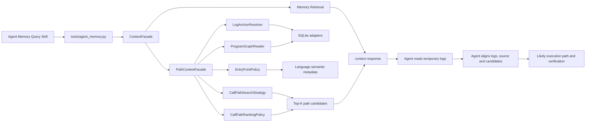

# 日志锚定的调用路径恢复设计

状态：Proposed
目标版本：分阶段实现
公开入口：现有 `context` 命令和 `agent-memory-query` Skill

## 1. 背景

本项目的故障定位目标不是让 Runtime 代替 Agent 诊断，而是让 Runtime 提供更
高质量的项目上下文。一个高价值场景是：Agent 在临时流水日志中发现一行可疑
日志，希望从该日志定位代码发射点，获得少量主要调用路径，再结合真实日志、
当前源码和反证还原最可能的实际执行路径。

现有 `context` 已能返回日志关键词、日志锚点、代码锚点和原始一跳关系，但尚未
提供从日志发射点到入口的有界、多候选、可解释调用路径。

## 2. 目标

1. 用户只需通过现有 Query Skill 或 `context --query "<日志行>"` 使用能力。
2. 精确或高质量日志匹配能够返回 Top-K 调用路径候选。
3. 每条路径绑定当前代码图 revision、节点、边、证据等级和缺失段。
4. Agent 使用候选路径中的预期日志锚点比对临时真实日志。
5. Runtime 不读取临时用户日志，不生成根因或最终因果链。
6. 当前优先支持 ArkTS，同时保持语言无关的核心模型和扩展接口。
7. 查询成本有界，适用于 50 万级记忆、日志语句和图边数据。

## 3. 非目标

- 不增加第五个用户 Skill。
- 不增加 `evidence-*`、`runtime-log-*` 或独立诊断命令。
- 不持久化临时日志、Agent 私有推理、候选根因或完整查询结果。
- 不把静态可达路径表述为真实执行路径。
- 第一阶段不实现动态插桩、全量 Trace 后端或动态程序切片。
- 不用一个不透明综合分数覆盖图缺口、语义歧义或当前源码。

## 4. 设计原则

### 4.1 门面模式

公开门面保持不变：

```bash
python tools/agent_memory.py context \
  --project . \
  --query "ProfileService profile load failed errorCode=401" \
  --json
```

`tools/agent_memory.py` 仍是唯一 Runtime 入口。命令处理器只调用
`ContextFacade.execute()`，不直接拼接日志锚点、图查询或路径评分。

`ContextFacade` 负责普通记忆查询，并在存在高质量代码日志锚点时调用内部
`PathContextFacade`。调用者不需要理解内部服务，也不需要选择搜索算法。

### 4.2 面向抽象编程

路径核心只依赖稳定领域接口，不依赖 SQLite SQL、ArkTS 语法或当前图表结构。

```text
Facade -> domain interfaces -> adapters

domain interfaces:
  LogAnchorResolver
  ProgramGraphReader
  EntryPointPolicy
  CallPathSearchStrategy
  CallPathRankingPolicy

adapters:
  SQLiteLogAnchorResolver
  SQLiteProgramGraphReader
  ArkTSEntryPointPolicy
  BoundedReversePathSearch
  EvidenceAwarePathRanking
```

语言差异在学习阶段适配成统一节点和边；查询阶段不出现
`if language == "arkts"` 之类的分支。

### 4.3 事实与推理分离

Runtime 可以声明：

- 哪条日志语句与输入匹配。
- 哪个函数包含该日志。
- 当前图中存在哪些可达路径。
- 路径使用了哪些 exact/static/heuristic 边。
- 哪些路径段缺失或存在歧义。

Runtime 不可以声明：

- 该路径本次一定执行过。
- 该路径就是根因链。
- 第一名候选具有某个未经校准的真实概率。

## 5. 总体架构



### 5.1 检索 Lane 隔离

`ContextFacade` 是统一门面，不是统一召回池。内部结果必须按 lane 隔离：

| Lane | 数据 | 可以影响什么 | 不得影响什么 |
|---|---|---|---|
| `log_anchor` | 代码日志模板、logger、event、位置 | `PathSeed` 匹配和歧义 | 经验排序、根因判断 |
| `program_path` | 当前有效代码图和语义边 | 候选路径、结构得分、缺口 | 记忆置信度、历史结论 |
| `semantic_correction` | 业务语义事实和纠正 | 节点解释、适用边界、警告 | 新增或删除图边 |
| `experience` | reflection、episode、历史 Incident | Agent 风险提示和验证建议 | seed、路径结构、路径排名 |

门面内部采用并行检索、单向装配：

```text
query
  +-> log_anchor lane -> PathSeed -> program_path lane -> path candidates
  +-> semantic_correction lane ---------------------------> annotations
  +-> experience lane ------------------------------------> advisory refs

assembler(path candidates, annotations, advisory refs)
  -> one context response
```

允许路径结果单向缩小经验查询范围：

```text
path file/symbol ids -> scoped experience lookup -> advisory refs
```

这样能减少“最近但仅弱相关”的经验，同时经验查询结果没有返回路径 lane 的通道。
日志图到代码图的 `emits_log/contains` 连接也是必要连接，不属于干扰。

禁止以下反向依赖：

```text
experience -> PathSeed
experience -> ProgramEdge
experience score -> structural_score
semantic correction -> synthetic call edge
path rank -> memory rerank
```

`PathContextFacade` 的输入只能是 `AnchorResolution`、当前 `GraphSnapshot` 和查询
预算，不能接收 reflections、episodes、historical likely causes 或完整 context
payload。这样即使最近经验与日志只有弱相关性，也不能改变发射点或候选调用路径。

各 lane 使用独立评分名称：

```text
anchor_match_score   # 日志文本到代码日志语句
structural_score     # 当前图中的路径质量
memory_rerank_score  # 历史记忆查询相关性
```

不得再生成跨 lane 的 `total_score`。最终 JSON 中 `path_context`、
`semantic_refs` 和 `experience_refs` 是同级字段；Agent 先看路径事实，再把经验作为
旁路提示。

## 6. 公开门面契约

### 6.1 输入

第一阶段不增加 CLI 参数。`context.query` 可以是：

- 完整可疑日志行。
- 稳定日志模板。
- logger、事件名和错误码组合。
- Agent 从临时日志提取的精确短语。

路径扩展仅在满足以下条件之一时激活：

1. 日志模板精确匹配。
2. logger/tag 与消息模板共同匹配。
3. event name 或错误码匹配到唯一或少量代码日志语句。

普通业务问题不应支付路径搜索成本。

### 6.2 输出

`context` 保持已有字段，`query_handoff` 可选增加：

```json
{
  "path_context": {
    "schema_version": "log-anchored-path-context/v1",
    "activation": {
      "activated": true,
      "reason": "exact_log_template",
      "anchor_ambiguity": 1
    },
    "path_seeds": [],
    "call_path_candidates": [],
    "coverage_gaps": [],
    "bounds": {},
    "role_boundary": {
      "runtime_returns_static_candidates": true,
      "runtime_reads_temporary_logs": false,
      "runtime_selects_actual_path": false,
      "agent_aligns_observed_logs": true
    }
  }
}
```

未激活时只返回紧凑原因，不返回空的大型候选结构。

## 7. 核心领域模型

### 7.1 `PathSeed`

```text
seed_id
log_statement_id
message_template
logger
event_name
emitter_symbol_id
file_path
source_span
source_revision
match_kind
match_score
ambiguity_group
```

`match_score` 表示检索匹配质量，不表示路径概率。

### 7.2 `ProgramNode`

```text
node_id
kind: file | symbol | lifecycle | route | callback | state | log
qualified_name
file_path
source_span
language
semantic_identity
```

### 7.3 `ProgramEdge`

```text
edge_id
source_id
target_id
relation
evidence_class: exact | static | heuristic | inferred
extractor_version
source_revision
valid_from
valid_to
ambiguity
```

第一阶段允许的路径关系：

```text
calls
awaits
registers_callback
handles_callback
dispatches_event
handles_event
routes_to
uses_service
contains
emits_log
```

`reads_state` 和 `writes_state` 作为旁路解释信息，不默认当作调用边。

### 7.4 `CallPathCandidate`

```text
path_id
seed_id
entry_node
emitter_node
nodes
edges
expected_log_anchors
structural_score
score_components
uncertainty
missing_segments
source_revision
```

`expected_log_anchors` 只列出路径节点附近已学习的代码日志模板，供 Agent 在真实
日志中查找。它们不是“必须出现”的事件。

## 8. 抽象接口

以下为接口形状，不是最终实现代码：

```python
class LogAnchorResolver(Protocol):
    def resolve(self, request: AnchorQuery) -> AnchorResolution: ...


class ProgramGraphReader(Protocol):
    def snapshot(self, project_id: str) -> GraphSnapshot: ...
    def predecessors(self, node_ids: Sequence[str], relations: set[str]) -> GraphPage: ...
    def nearby_logs(self, node_ids: Sequence[str]) -> Sequence[LogAnchor]: ...


class EntryPointPolicy(Protocol):
    def classify(self, nodes: Sequence[ProgramNode]) -> Sequence[EntryPoint]: ...


class CallPathSearchStrategy(Protocol):
    def search(self, request: PathSearchRequest, graph: ProgramGraphReader) -> Sequence[RawPath]: ...


class CallPathRankingPolicy(Protocol):
    def rank(self, request: PathRankRequest, paths: Sequence[RawPath]) -> Sequence[CallPathCandidate]: ...
```

`PathContextFacade` 负责：

1. 验证请求和查询预算。
2. 调用 `LogAnchorResolver`。
3. 为每个有效 seed 调用搜索策略。
4. 使用排序策略合并、去重并保持路径多样性。
5. 组装稳定输出契约和审计信息。

Facade 不包含 SQL、图搜索循环、语言规则或评分常量。

### 8.1 依赖装配规则

`runtime_entry.py` 是 composition root：它创建具体 adapter，并通过构造参数注入
`PathContextFacade` 和 `ContextFacade`。禁止在领域服务内部读取全局容器、导入
具体 SQLite adapter 或自行创建数据库连接。

接口由使用方所在的 domain 层定义，adapter 依赖接口，而不是让 domain 依赖
adapter。接口返回领域结果与显式错误，不泄漏 `sqlite3.Row`、SQL 游标或 ArkTS
解析器内部对象。

为避免门面退化成 God Object：

- `ContextFacade` 只编排普通查询和可选路径上下文。
- `PathContextFacade` 只编排五个路径端口。
- 匹配、遍历、入口识别和评分分别由单一职责实现承担。
- 输出序列化与领域模型分离。
- 新语言不得要求修改两个 Facade 的控制流。

## 9. 路径恢复算法

### 9.1 日志锚点解析

解析优先级：

```text
exact normalized template
event_name + logger
stable literal + logger
error_code + nearby business terms
FTS5 fallback
```

标准化时只删除时间戳、PID/TID、地址、UUID 和明显运行时变量，不应删除错误码、
路由、资源名或业务实体。

若多个代码位置发射相同模板，为每个位置生成独立 seed，并报告歧义。

### 9.2 需求驱动反向搜索

从 emitter symbol 反向搜索入口，而不是遍历全图：

```text
emitter
  <- direct caller
  <- async/callback owner
  <- lifecycle, route, event or public API entry
```

默认预算：

```text
max_depth = 6
max_nodes = 80
max_edges = 160
max_raw_paths_per_seed = 20
max_returned_paths = 5
max_same_entry_paths = 2
cycle_visit_limit = 1
```

搜索必须：

- 仅使用当前有效 revision 的边。
- 对 SCC/递归进行折叠或限制访问。
- 区分同步调用、异步调度和框架生命周期连接。
- 在预算耗尽时返回 truncation 和 frontier，不假装图已完整。

### 9.3 入口分类

通用入口类别：

```text
public_api
route
lifecycle
event_handler
callback
scheduled_job
message_consumer
test_entry
unknown_entry
```

ArkTS 第一阶段适配：

- Ability 生命周期。
- 页面生命周期。
- Router/NavPathStack 入口。
- `@Entry` Component。
- UI 事件处理函数。
- 回调注册和 Promise/async continuation。

其他语言通过新的 `EntryPointPolicy` 或学习期语义 Provider 扩展，路径搜索核心不变。

### 9.4 路径排序

建议使用可解释加权成本，不使用伪概率：

```text
结构得分 =
  exact/static 边奖励
  当前 revision 奖励
  明确入口奖励
  查询实体覆盖奖励
  路径简洁度奖励
  - heuristic/inferred 边惩罚
  - 动态分派歧义惩罚
  - 缺失段惩罚
  - 循环惩罚
```

排序采用硬门禁后加权排序：

1. 失效 revision、非法关系和越界路径先剔除。
2. 精确/静态证据覆盖优先。
3. 结构得分仅排序剩余候选。
4. 使用入口和路径前缀去重，保留不同机制的候选。

只有积累足够已验证执行案例后，才能校准为概率；在此之前字段必须命名为
`structural_score` 或 `alignment_score`。

## 10. Agent 与真实日志的对齐协议

第一阶段 Runtime 不接受日志文件。Agent 执行：

1. 从可疑行查询 `context`。
2. 获取 `call_path_candidates` 和 `expected_log_anchors`。
3. 在临时日志中搜索每条候选路径的日志锚点。
4. 按 trace/request/session、线程局部顺序和时间窗口整理观察事件。
5. 比较候选路径，阅读当前源码中的分支、异常和状态传播。
6. 输出最吻合路径、至少一个替代路径、反证和缺失证据。

对齐采用过程挖掘中的三种移动思想：

```text
synchronous move: 观察日志与候选路径锚点匹配
model move: 路径存在节点，但日志没有对应观察
log move: 日志存在事件，但候选路径没有对应节点
```

Agent 可以计算解释性分数：

```text
alignment_score =
  ordered_anchor_coverage
  + trace_or_session_consistency
  + source_branch_consistency
  + exact_edge_ratio
  - order_violation
  - missing_high_value_anchor
  - heuristic_edge_ratio
```

没有日志不自动否定路径，因为日志可能受分支、级别、采样和缓冲影响。

### 并发与异步顺序

事件顺序优先级：

```text
trace/span parent relation
request/session/callback identity
same-thread local order
timestamp
raw file line order
```

无法确定顺序时保留偏序，不强行形成一条全序时间线。

## 11. Trace Context 增强

若允许修改项目日志，优先补充：

```text
event_name
trace_id
span_id
parent_span_id
request_id
session_id
stage
result
error_code
```

有完整 trace/span 父子关系时，Agent 应优先采用动态关系；静态路径用于补齐未
采样节点和连接源码位置。没有关联字段时，退化到日志模板、局部顺序和静态路径
对齐。

## 12. 存储与性能

### 12.1 SQLite 仍是事实源

第一阶段不新增持久化候选路径表。候选路径由当前有效图按需计算，避免代码更新
后维护大量派生路径。

允许增加的派生索引：

```text
code_log_statements(normalized_template, logger, project_id)
memory_edges(project_id, target_id, relation, valid_to)
memory_edges(project_id, source_id, relation, valid_to)
code_symbols(project_id, qualified_name, file_path)
```

### 12.2 缓存

只缓存 revision-bound 的图邻接页或 seed 到候选路径结果：

```text
cache key = project_id + graph_revision + seed_id + bounds_version
```

图 revision 变化后自然失效。缓存是可删除的派生数据，不是第二事实源。

### 12.3 查询预算

- 路径扩展只对强日志锚点激活。
- SQL 批量读取 frontier，禁止节点级 N+1 查询。
- 每轮按一组 node id 查询 predecessors。
- 先使用关系和 revision 索引过滤，再在内存中组装少量路径。
- 超过预算返回 coverage gap，不降级为全图扫描。

## 13. 文件和模块规划

每个 Python 文件不得超过 500 行：

```text
tools/agent_memory_runtime/
  context_facade.py              # 公开 context 用例门面
  path_context_facade.py         # 内部路径上下文门面
  path_context_models.py         # 不可变请求/响应模型
  path_context_ports.py          # Protocol 抽象
  path_anchor_sqlite.py          # SQLite 日志锚点适配器
  path_graph_sqlite.py           # SQLite 图读取适配器
  path_entry_policy.py           # 通用与 ArkTS 入口策略
  path_search.py                 # 有界反向搜索
  path_ranking.py                # 门禁、评分和多样性
  context_composition.py         # 适配器组合根
```

依赖方向：

```text
command_handlers -> ContextFacade
ContextFacade -> PathContextFacade
PathContextFacade -> ports + models
SQLite/ArkTS/search/ranking adapters -> ports + models
ports + models -> no infrastructure dependencies
```

禁止 `path_context_facade.py` 反向依赖 CLI parser、SQLite connection 或 ArkTS
解析实现。

## 14. 分阶段实施计划

当前实现状态（2026-07-15）：阶段 A/B 的门面、抽象、SQLite 适配器、ArkTS 入口、
有界反向搜索、纯结构排序和 `context` 接线已完成；阶段 C 的 Query Skill 对齐协议、
隔离回归和既有 Agent A/B Runner 接线已完成。阶段 D 已完成按层批量读取、有效边
relation 组合索引、资源截断和 revision 输出，50 万级真实项目 p95 校准仍需独立压测样本。
阶段 E 仅完成稳定 event name/Trace Context 使用指导和 exact/static 来源优先级；任何
数据驱动排序校准都必须等已验证样本充足后再启用，不能用合成结论替代验收。

### 阶段 A：契约和门面骨架

- 定义 v1 请求、seed、path candidate 和响应模型。
- 定义五个核心 Protocol。
- 引入 `ContextFacade`，保持现有输出兼容。
- 实现 no-op `PathContextFacade` 和契约测试。

验收：普通 `context` 输出与性能无回归，公开命令和四个 Skill 不增加。

### 阶段 B：日志到调用路径

- 实现 SQLite 日志锚点和图 Reader。
- 实现有界反向搜索、入口分类、路径评分和多样性。
- 把 `path_context` 接入 `query_handoff`。
- 为 ArkTS 页面、Ability、路由、事件和回调增加 fixture。

验收：给定已知日志模板，正确发射函数进入 Top-1，真实入口路径进入 Top-3。

### 阶段 C：Agent 日志对齐协议

- 更新 Query Skill，使 Agent 消费 expected log anchors。
- 增加多候选、缺失日志、噪声日志、异步偏序案例。
- A/B Benchmark 比较是否减少源码读取和错误路径选择。

验收：Runtime 不读取临时日志；Agent Runner 的路径选择优于无路径上下文基线。

### 阶段 D：语义精度和性能

- 加强 ArkTS callback/async/lifecycle 边。
- 增加 demand-driven 批量 SQL 和 revision-bound 缓存。
- 在 50 万级数据集压测 p50/p95、查询数、候选路径质量和输出 token。

验收：无 N+1 查询，超预算明确截断，普通查询不承担路径搜索成本。

### 阶段 E：可观测性与校准

- 指导项目增加少量 Trace Context 和稳定 event name。
- 用已验证案例记录紧凑路径反馈。
- 样本充足后校准排序；校准只能作为候选排序信号。

验收：动态关联事实优先于静态推测，旧案例不能覆盖当前 revision。

## 15. 测试策略

### 单元测试

- 日志模板标准化与歧义保留。
- 每个 Protocol 的 fake adapter 契约。
- 深度、节点、边、路径和循环预算。
- exact/static/heuristic 门禁及评分分解。
- 路径去重和入口多样性。
- 增加高分但无关经验后，seed、路径集合和结构排名完全不变。
- 调整 reflection 排序后，`path_context` 字节级等价。
- 经验包含相同日志文本时，不能被解析为代码日志锚点。
- 业务语义纠正只能产生 annotation，不能产生合成调用边。

### 集成测试

- 日志行到 emitter、入口和 Top-K 路径。
- 路由、Ability、页面生命周期、async 和 callback。
- stale edge、revision drift、图缺口和未学习文件。
- 50 万级索引和批量 frontier SQL。
- 普通 context、日志锚点、程序路径和经验 lane 的预算分别生效。
- stale code/log 记录被排除，但历史经验仍能作为带警告的 advisory ref 返回。

### Agent A/B 测试

同一个 Agent Runner、源码和临时日志：

```text
Baseline = context without path_context
Treatment = context with path_context
```

指标：

- emitter recall@1。
- actual path recall@3。
- 错误路径选择率。
- 源码读取文件数。
- 查询轮数和 token 数。
- 最终根因与受影响文件准确率。

隐藏 Oracle 只用于评测，不进入 Runtime 输出。

## 16. 失败与降级

| 情况 | 行为 |
|---|---|
| 没有日志锚点 | 返回普通 context 和 `missing_log_anchor` |
| 多个相同日志模板 | 返回多个 seed，不提前消歧 |
| 没有调用者 | 把 emitter 作为 unknown entry，并报告图缺口 |
| 路径超预算 | 返回已完成候选、frontier 和 truncation |
| 图 revision 过期 | 不使用缓存，提示 focused relearn |
| 只有 heuristic 边 | 返回低结构置信和明确警告 |
| 有 trace/span | 优先把动态身份交给 Agent 对齐 |

## 17. 理论与实践出处

1. **SherLog: Error Diagnosis by Connecting Clues from Run-time Logs**：从运行日志
   和源码推断失败执行中必然或可能发生的控制流与数据值，是本设计“日志约束的
   路径恢复”主要理论来源。
   <https://www.eecg.utoronto.ca/~yuan/papers/sherlog_abstract.html>

2. **CodeQL Path Queries**：使用 source、sink 和 path graph 生成可解释源码路径；
   其 bounded reverse partial flow 是需求驱动反向搜索的重要工程参考。
   <https://codeql.github.com/docs/writing-codeql-queries/creating-path-queries/>
   <https://codeql.github.com/docs/writing-codeql-queries/debugging-data-flow-queries-using-partial-flow/>

3. **Dynamic Program Slicing**：针对一次具体执行寻找真正影响目标位置的语句，
   说明静态候选与动态执行证据必须区分。
   <https://dl.acm.org/doi/10.1145/93542.93576>

4. **Replaying History on Process Models for Conformance Checking and Performance
   Analysis**：事件日志与模型路径 Alignment、同步移动和偏差量化的来源。
   <https://doi.org/10.1002/widm.1045>

5. **Aligning Partially-Ordered Process-Execution Traces and Models Using Automated
   Planning**：并发和异步日志不应被强制转换为错误全序。
   <https://ojs.aaai.org/index.php/ICAPS/article/view/13911>

6. **OpenTelemetry Logs Data Model and Log/Trace Correlation**：`TraceId`、`SpanId`、
   `EventName`、Resource 和日志关联字段的标准来源。
   <https://opentelemetry.io/docs/specs/otel/logs/data-model/>
   <https://opentelemetry.io/docs/specs/otel/logs/>

7. **W3C Trace Context**：跨组件传播 `traceparent`/`tracestate` 和请求身份的标准。
   <https://www.w3.org/TR/trace-context/>

8. **Dapper, a Large-Scale Distributed Systems Tracing Infrastructure**：低开销、
   采样和公共库集中插桩的成熟实践。
   <https://research.google/pubs/dapper-a-large-scale-distributed-systems-tracing-infrastructure/>

## 18. 最终决策

采用“单一 `context` 门面 + 抽象路径服务 + Agent 动态对齐”的长期架构：

- Runtime 将可疑日志映射为 Top-K、可解释、revision-bound 的静态调用路径。
- Agent 直接读取临时真实日志，完成顺序、分支、关联身份和源码机制比对。
- 静态路径是上下文，不是诊断结论；动态 Trace 是事实，但仍需源码解释和验证。
- 新语言通过学习期语义 Provider 和入口策略扩展，不修改核心路径算法。
